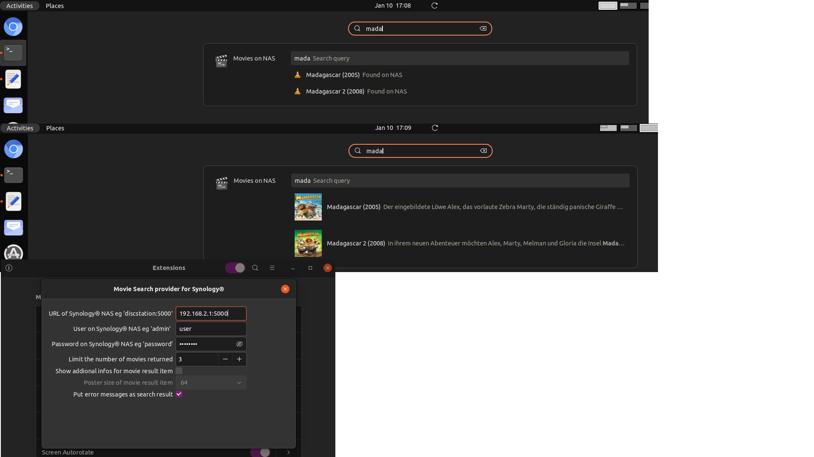

# Gnome 4.0 Movie Search provider for Synology®
Searching for movie titles on Synology® NAS including offline search (yet to come). Source and thanks to https://github.com/MrNinso/gnome-shell-google-search-provider. Developed by Peter Sasse for [Gnome Shell](https://wiki.gnome.org/Projects/GnomeShell). Installation https://extensions.gnome.org/extension/3969/gnome-movie-search-provider-for-synology/.

